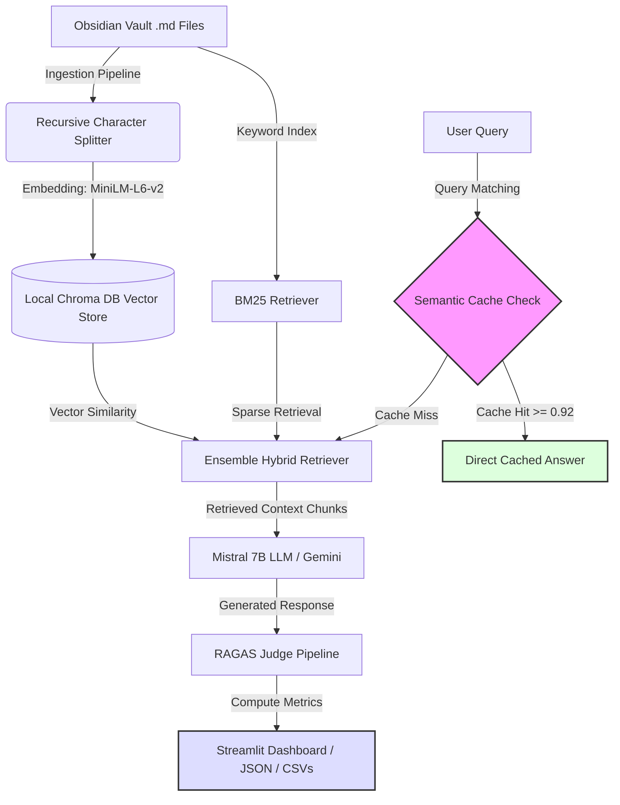

# 🚀 VaultRAG: Personal Knowledge RAG Evaluation Framework

[](https://www.python.org/)
[](https://www.langchain.com/)
[](https://github.com/explodinggradients/ragas)
[](https://www.trychroma.com/)
[](https://streamlit.io/)
[](https://ollama.com/)

An end-to-end **Retrieval-Augmented Generation (RAG)** pipeline implementation, automated evaluation, and analytics dashboard designed to optimize knowledge-base search.

This project demonstrates the system engineering, data pipelining, and performance analysis required to take raw unstructured documents (such as a personal Obsidian knowledge base) and serve highly accurate, grounded answers while actively monitoring and optimizing API costs, speed, and correctness.

---

## 🏗️ Architecture & Pipeline Flow

The following diagram illustrates the complete ingestion, retrieval, caching, generation, and automated evaluation workflow:



---

## 🌟 Key Engineering Highlights

This framework serves as a core portfolio piece demonstrating production-level AI engineering practices:

- **Hybrid Retrieval Engineering:** Implemented a balanced `EnsembleRetriever` combining dense vector representation (ChromaDB semantic search) and sparse keyword-matching (`BM25Retriever`) to capture both general concepts and exact technical terms.
- **Automated LLM Evaluation (RAGAS):** Integrated the **RAGAS framework** to objectively audit pipeline performance across critical metrics like _Faithfulness_, _Context Recall_, _Answer Relevancy_, and _Factual Correctness_.
- **System Optimization & Caching:** Developed an embedding-based `SemanticCache` layer with a cosine similarity threshold of `0.92`, preventing redundant external LLM calls and significantly reducing API operating expenses.
- **Production Problem Solving:** Debugged complex third-party library conflicts, resolved API quota exhaustion bottlenecks by implementing optional regrounding steps and rate limiting, and corrected silent NaN score failures within RAGAS evaluations.
- **Interactive Visualization:** Built a complete Streamlit-based operations dashboard to allow stakeholders to run comparisons, monitor aggregate pipeline metrics, and review raw retrieval/generation logs.

---

## 📊 Empirical Evaluation: Cosine vs. Hybrid Retriever

Below are the audited mean performance scores calculated during our pipeline evaluations:

| RAGAS Metric            | Cosine Retriever | Hybrid Retriever (BM25 + Cosine) |          Delta           |
| :---------------------- | :--------------: | :------------------------------: | :----------------------: |
| **Factual Correctness** |      0.4233      |            **0.5767**            | **+0.1534 (+36.24%)** 📈 |
| **Answer Relevancy**    |      0.5941      |            **0.6186**            | **+0.0245 (+4.12%)** 📈  |
| **Context Recall**      |    **0.4583**    |            **0.4583**            |    0.0000 (0.00%) ➖     |
| **Faithfulness**        |    **0.9167**    |              0.6786              |   -0.2381 (-25.97%) 📉   |

> [!TIP]
> **Engineering Decision:** To achieve maximum accuracy in production, we leverage the **Hybrid Retriever** for technical terminology/keyword queries, while routing to the **Cosine Retriever** when users request conceptual, long-form synthesis.

---

## 🛠️ Technology Stack

- **Language:** Python 3.10+
- **Orchestration:** LangChain (Chains, Document Loaders, Retrievers)
- **Vector Database:** ChromaDB
- **Evaluation:** RAGAS (Retrieval Augmented Generation Assessment)
- **LLMs & Embeddings:** Mistral 7B (via Ollama local host), HuggingFace SentenceTransformers (`all-MiniLM-L6-v2`)
- **UI & Frontend:** Streamlit, Pandas, Plotly

---

## 🚀 Quick Start & Reproduction

Follow these steps to run the ingestion, evaluation, and dashboard pipelines locally.

### 1. Prerequisites & Installation

Ensure you have Python 3.10+ installed. Clone this repository, then create and activate a virtual environment:

```bash
python -m venv venv
source venv/bin/activate  # On Windows: venv\Scripts\activate
```

Install the pinned dependencies:

```bash
pip install -r requirements.txt
```

### 2. Configuration

Copy `.env.example` to `.env` and configure your parameters:

```bash
# On Linux/macOS
cp .env.example .env

# On Windows PowerShell
Copy-Item .env.example .env
```

Open `.env` and specify the path to your source markdown folder:

```env
OBSIDIAN_VAULT_PATH=C:/path/to/your/markdown/documents
```

### 3. Execution Run

Run the three primary pipelines sequentially:

1.  **Ingestion & Indexing:** Parses, chunks, and writes documents into the vector store:
    ```bash
    python -m src.ingestor
    ```
2.  **RAGAS Evaluation Pipeline:** Runs test queries, collects outputs, and computes evaluation scores using Ollama/Mistral 7B:
    ```bash
    python -m src.evaluator
    ```
3.  **Launch Dashboard:** Serves the interactive analysis dashboard:
    ```bash
    streamlit run src/dashboard.py
    ```

---

## 📂 Repository Structure

- `src/`
  - [`ingestor.py`](src/ingestor.py): Document loader, character splitter, and Chroma vector database batch writes.
  - [`agent.py`](src/agent.py): Standard and hybrid retrieval chain constructs and the `SemanticCache` class.
  - [`evaluator.py`](src/evaluator.py): RAGAS evaluation pipeline for both retriever variants with side-by-side scoring.
  - [`compare_retrievers.py`](src/compare_retrievers.py): Runs both chains on the testset and produces a qualitative answer comparison.
  - [`dashboard.py`](src/dashboard.py): Interactive Streamlit analytics dashboard.
- `results/`: Evaluation CSVs, retriever comparison JSON, and metric data files.
- [`findings.md`](findings.md): Architectural decisions, trade-off analysis, and optimization notes.

---

### 📩 Contact & Collaboration

I am an **AI Engineer / Data Scientist** specialized in building robust, production-ready LLM pipelines. Let's connect!

- **LinkedIn:** [Your LinkedIn Profile]
- **Portfolio:** [Your Portfolio Website]
- **Email:** [Your Email Address]
